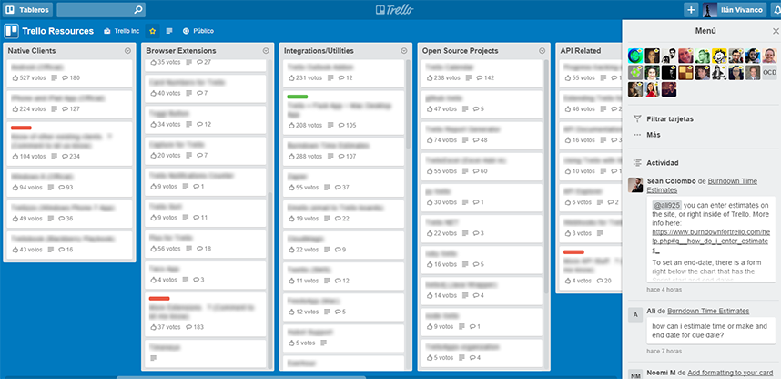

# blurTrelloTitles
A very little script to blur the content of [Trello](http://trello.com/) cards for taking screenshots and showing what your board looks like.



#### Bookmarklet

Add the bookmarklet by selecting and dragging it to your bookmarks bar. Then go to your Trello Board and click the bookmark to toggle the blurness.

```javascript
javascript:if($('.list-card-title').hasClass('blurTitle')){$('.list-card-title').css({"color":"black","text-shadow":"none"}).removeClass('blurTitle');}else{$('.list-card-title').css({"color":"transparent","text-shadow":"0 0 10px black"}).addClass('blurTitle');};void 0;
```
